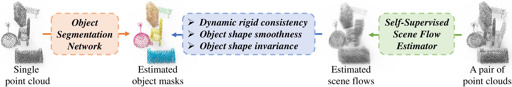
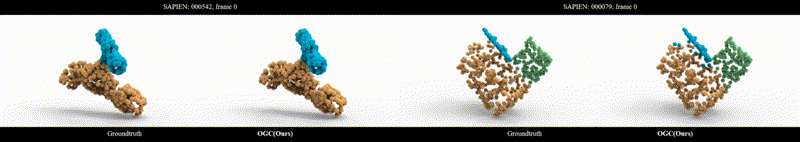
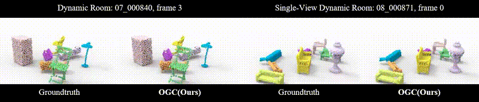
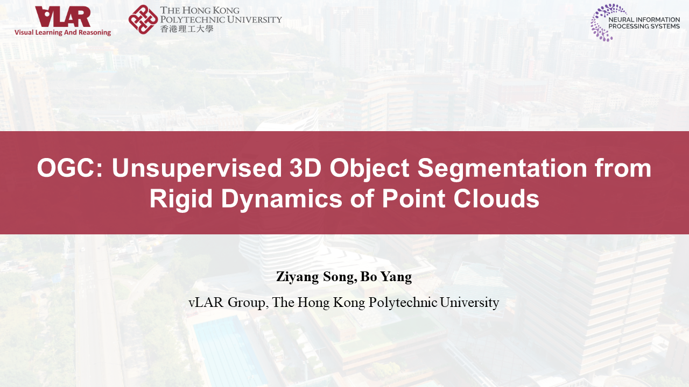

[](https://arxiv.org/abs/2210.04458)

[](https://creativecommons.org/licenses/by-nc-sa/4.0/legalcode)
[](https://twitter.com/vLAR_Group)

## OGC: Unsupervised 3D Object Segmentation from Rigid Dynamics of Point Clouds (NeurIPS 2022)
[Ziyang Song](https://szy-young.github.io/), [Bo Yang](https://yang7879.github.io/)


### !Updates:

New contents in the extension of OGC have been included in this repo:
- [x] Support for Waymo Open dataset.
- [x] A multi-frame co-segmentation algorithm to leverage multi-frame inputs in testing.
- [ ] Support for SparseConv & Point Transformer backbones in the object segmentation network.


### Overview

We propose the first unsupervised 3D object segmentation method, learning from dynamic motion patterns in point cloud sequences.



Our method demonstrates promising results on various scenarios:
- **Object part instance segmentation**



- **Object segmentation in indoor scenes**



- **Object segmentation in outdoor scenes**


### [Full demo (Youtube)](https://www.youtube.com/watch?v=dZBjvKWJ4K0)

<p align="center"> <a href="https://www.youtube.com/watch?v=dZBjvKWJ4K0"></a> </p>

## 1. Environment

Please first install a **GPU-supported pytorch** version which fits your machine.
We have tested with pytorch 1.9.0.

Install PointNet2 CPP lib:
```shell script
cd pointnet2
python setup.py install
cd ..
```

Install other dependencies:
```shell script
pip install -r requirements
```

**(Optional)** Install Open3D for the visualization of point cloud segmentation:
```shell script
pip install open3d
```


## 2. Data preparation

### (1) SAPIEN

Please download from links provided by [MultibodySync](https://github.com/huangjh-pub/multibody-sync):
- Train+Val (`mbs-shapepart`): [Google Drive](https://drive.google.com/file/d/1aGTn-PYxLjnhj9UKlv4YFV3Mt1E3ftci/view?usp=sharing)
- Test (`mbs-sapien`): [Google Drive](https://drive.google.com/file/d/1HR2X0DjgXLwp8K5n2nsvfGTcDMSckX5Z/view?usp=sharing)

Then put them into your `${SAPIEN}` path.

### (2) OGC-DR (Dynamic Room) & OGC-DRSV (Single-View Dynamic Room)

Please download the complete datasets from links below:
- OGC-DR: [Dropbox](https://www.dropbox.com/s/guni0d87phls4sd/OGC_DynamicRoom.zip?dl=0)
- OGC-DRSV: [Dropbox](https://www.dropbox.com/s/67rzl2ku37e2urt/OGC_DynamicRoom_SingleView.zip?dl=0)

Alternatively, you can generate the dataset by yourself.

**OGC-DR:** Please first download the [ShapeNet Core v1](https://shapenet.cs.stanford.edu/shapenet/obj-zip/ShapeNetCore.v1.zip).
Select the archives according to object categories specified in `data_prepare/ogcdr/meta.yaml` and unzip them into your `${OGC_DR}/ShapeNet_mesh` path.
Then run the following script to generate the dataset.
```shell script
python data_prepare/ogcdr/build_ogcdr.py ${OGC_DR}
```

**OGC-DRSV:** Run the following script to collect single depth scans on OGC-DR mesh models and generate incomplete point cloud dataset OGC-DRSV.
```shell script
python data_prepare/ogcdrsv/build_ogcdrsv.py --src_root ${OGC_DR} --dest_root ${OGC_DRSV}
```
Collect groundtruth segmentation for OGC-DRSV and downsample the point clouds:
```shell script
python data_prepare/ogcdrsv/collect_segm.py --src_root ${OGC_DR} --dest_root ${OGC_DRSV}
```

### (3) KITTI-SF (Scene Flow)

Please first download:
- [scene flow](https://s3.eu-central-1.amazonaws.com/avg-kitti/data_scene_flow.zip) and [calibration files](https://s3.eu-central-1.amazonaws.com/avg-kitti/data_scene_flow_calib.zip), from [KITTI Scene Flow Evaluation 2015](http://www.cvlibs.net/datasets/kitti/eval_scene_flow.php)
- [semantic instance segmentation label](https://s3.eu-central-1.amazonaws.com/avg-kitti/data_semantics.zip), from [KITTI Semantic Instance Segmentation Evaluation](http://www.cvlibs.net/datasets/kitti/eval_instance_seg.php?benchmark=instanceSeg2015)

Merge the `training` folder of them in your `${KITTI_SF}` path.
Then run the following script to unproject **disparity, optical flow, 2D segmentation** into **point cloud, scene flow, 3D segmentation**:
```shell script
python data_prepare/kittisf/process_kittisf.py ${KITTI_SF}
```

Finally, downsample all point clouds to 8192-point:
```shell script
python data_prepare/kittisf/downsample_kittisf.py ${KITTI_SF} --save_root ${KITTI_SF}_downsampled
# After extracting flow estimations in the following, come back here to downsample flow estimations
python data_prepare/kittisf/downsample_kittisf.py ${KITTI_SF} --save_root ${KITTI_SF}_downsampled --predflow_path flowstep3d
```
`${KITTI_SF}_downsampled` will be the path for the downsampled dataset.

### (4) KITTI-Det (Detection)

Please first download the following items from [KITTI 3D Object Detection Evaluation 2017](http://www.cvlibs.net/datasets/kitti/eval_object.php?obj_benchmark=3d):
- [velodyne point clouds](https://s3.eu-central-1.amazonaws.com/avg-kitti/data_object_velodyne.zip)
- [left color image](https://s3.eu-central-1.amazonaws.com/avg-kitti/data_object_image_2.zip)
- [calibration files](https://s3.eu-central-1.amazonaws.com/avg-kitti/data_object_calib.zip)
- [object bounding box label](https://s3.eu-central-1.amazonaws.com/avg-kitti/data_object_label_2.zip)

Merge the `training` folder of them in your `${KITTI_DET}` path.
Then run the following script to extract 8192-point **front-view** point cloud, and obtain segmentation from bounding box annotations.
```shell script
python data_prepare/kittidet/process_kittidet.py ${KITTI_DET}
```

### (5) SemanticKITTI

Please first download the following iterms from [SemanticKITTI](http://www.semantic-kitti.org/dataset.html#download):
- [velodyne point clouds](http://www.cvlibs.net/download.php?file=data_odometry_velodyne.zip)
- [calibration files](http://www.cvlibs.net/download.php?file=data_odometry_calib.zip)
- [segmentation label](www.semantic-kitti.org/assets/data_odometry_labels.zip)

Merge the `velodyne`, `labels` and `calib.txt` of each sequence. The organized dataset should be as follows:
```shell script
SemanticKITTI
└── sequences
    └── 00
    │   ├── velodyne
    │   ├── labels
    │   └── calib.txt
    └── 01
    ...
```
Then run the following script to extract 8192-point **front-view** point cloud, and obtain segmentation from panoptic annotations.
```shell script
python data_prepare/semantickitti/process_semantickitti.py ${SEMANTIC_KITTI}
```

### (6) Waymo Open

Please first register at the [Waymo Open Dataset](https://waymo.com/open/download/), then download the [raw data](https://console.cloud.google.com/storage/browser/waymo_open_dataset_scene_flow;tab=objects?prefix=&forceOnObjectsSortingFiltering=false).
1. Process raw data into point clouds. Please carefully follow the instructions in [OpenPCDet](https://github.com/open-mmlab/OpenPCDet/blob/master/docs/GETTING_STARTED.md#waymo-open-dataset). 
You need to install [waymo-open-dataset](https://github.com/waymo-research/waymo-open-dataset) and [OpenPCDet](https://github.com/open-mmlab/OpenPCDet) here.
2. Extract groundtruth scene flow. Please follow the instructions in [DCA-SRSFE](https://github.com/leolyj/DCA-SRSFE).
3. Generate groundtruth segmentations from bounding box annotations:
```shell script
python data_prepare/waymo/process_waymo.py --data_root $WAYMO_RAW --save_root $WAYMO --split $SPLIT
```
4. Downsample all point clouds to 8192-point:
```shell script
python data_prepare/waymo/downsample_waymo.py --data_root $WAYMO --save_root ${WAYMO}_downsampled --split $SPLIT
# After extracting flow estimations in the following, come back here to downsample flow estimations
python data_prepare/waymo/downsample_waymo.py --data_root $WAYMO --save_root ${WAYMO}_downsampled --split $SPLIT --predflow_path flowstep3d
```


## 3. Pre-trained models

You can download all our pre-trained models from [Dropbox](https://www.dropbox.com/s/k4hv71952i0yrye/OGC_ckpt.zip?dl=0) (including self-supervised scene flow networks, and unsupervised/supervised segmentation networks) and extract them to `./ckpt`.


## 4. Scene flow estimation

### Train

Train the self-supervised scene flow networks:
```shell script
# SAPIEN 
python train_flow.py config/flow/sapien/sapien_unsup.yaml
# OGC-DR 
python train_flow.py config/flow/ogcdr/ogcdr_unsup.yaml
# OGC-DRSV 
python train_flow.py config/flow/ogcdrsv/ogcdrsv_unsup.yaml
```
For KITTI-SF dataset, we directly employ the pre-trained model released by [FlowStep3D](https://github.com/yairkit/flowstep3d).

### Test

Evaluate and save the scene flow estimations.
```shell script
# SAPIEN 
python test_flow.py config/flow/sapien/sapien_unsup.yaml --split ${SPLIT} --save
# OGC-DR 
python test_flow.py config/flow/ogcdr/ogcdr_unsup.yaml --split ${SPLIT} --test_batch_size 12 --test_model_iters 5 --save
# OGC-DRSV 
python test_flow.py config/flow/ogcdrsv/ogcdrsv_unsup.yaml --split ${SPLIT} --test_batch_size 12 --test_model_iters 5 --save
# KITTI-SF 
python test_flow_kittisf.py config/flow/kittisf/kittisf_unsup.yaml --split ${SPLIT} --test_model_iters 5 --save
# Waymo Open
python test_flow_waymo.py config/flow/waymo/kittisf_unsup.yaml --split ${SPLIT} --use_odometry --bound --test_model_iters 5 --save
```
`${SPLIT}` can be train/val/test for SAPIEN & OGC-DR/OGC-DRSV, train/val for KITTI-SF & Waymo Open.


## 5. Unsupervised segmentation

### Train

Alternate the segmentation network training and scene flow improvement for *R* rounds. 
In each `${ROUND}` (starting from 1):
```shell script
# SAPIEN: first R-1 rounds
python train_seg.py config/seg/sapien/sapien_unsup_woinv.yaml --round ${ROUND}
python oa_icp.py config/seg/sapien/sapien_unsup_woinv.yaml --split ${SPLIT} --round ${ROUND} --save
# SAPIEN: the last round
python train_seg.py config/seg/sapien/sapien_unsup.yaml --round ${ROUND}

# OGC-DR: first R-1 rounds
python train_seg.py config/seg/ogcdr/ogcdr_unsup_woinv.yaml --round ${ROUND}
python oa_icp.py config/seg/ogcdr/ogcdr_unsup_woinv.yaml --split ${SPLIT} --round ${ROUND} --test_batch_size 24 --save
# OGC-DR: the last round
python train_seg.py config/seg/ogcdr/ogcdr_unsup.yaml --round ${ROUND}

# OGC-DRSV: first R-1 rounds
python train_seg.py config/seg/ogcdrsv/ogcdrsv_unsup_woinv.yaml --round ${ROUND}
python oa_icp.py config/seg/ogcdrsv/ogcdrsv_unsup_woinv.yaml --split ${SPLIT} --round ${ROUND} --test_batch_size 24 --save
# OGC-DRSV: the last round
python train_seg.py config/seg/ogcdrsv/ogcdrsv_unsup.yaml --round ${ROUND}

# KITTI-SF: first R-1 rounds
python train_seg.py config/seg/kittisf/kittisf_unsup_woinv.yaml --round ${ROUND}
python oa_icp.py config/seg/kittisf/kittisf_unsup_woinv.yaml --split ${SPLIT} --round ${ROUND} --test_batch_size 4 --save
# KITTI-SF: the last round
python train_seg.py config/seg/kittisf/kittisf_unsup.yaml --round ${ROUND}

# Waymo Open: only 1 round
python train_seg_waymo.py config/seg/waymo/waymo_unsup.yaml --round 1
```
When performing scene flow improvement, `${SPLIT}` needs to traverse train/val/test for SAPIEN & OGC-DR/OGC-DRSV, train/val for KITTI-SF.

### Test

```shell script
# SAPIEN 
python test_seg.py config/seg/sapien/sapien_unsup.yaml --split test --round ${ROUND}
# OGC-DR 
python test_seg.py config/seg/ogcdr/ogcdr_unsup.yaml --split test --round ${ROUND} --test_batch_size 16
# OGC-DRSV 
python test_seg.py config/seg/ogcdrsv/ogcdrsv_unsup.yaml --split test --round ${ROUND} --test_batch_size 16
# KITTI-SF 
python test_seg.py config/seg/kittisf/kittisf_unsup.yaml --split val --round ${ROUND} --test_batch_size 8
# KITTI-Det 
python test_seg.py config/seg/kittidet/kittisf_unsup.yaml --split val --round ${ROUND} --test_batch_size 8
# SemanticKITTI 
python test_seg.py config/seg/semantickitti/kittisf_unsup.yaml --round ${ROUND} --test_batch_size 8
# Waymo Open
python test_seg_waymo.py config/seg/waymo/waymo_unsup.yaml --split val --round 1 --test_batch_size 8
```
`${ROUND}` can be 1/2/3/..., and we take **2 rounds** as default in our experiments.
Specify `--save` to save the estimations. 
Specify `--visualize` for qualitative evaluation mode.

### Test the scene flow improvement

Your can follow the evaluation settings of FlowStep3D to test the improved flow, and see how our method push the boundaries of unsupervised scene flow estimation:
```shell script
# Refine the scene flow estimations
python oa_icp.py config/seg/kittisf/kittisf_unsup.yaml --split train --round 2 --test_batch_size 4 --save --saveflow_path flowstep3d_for-benchmark
python oa_icp.py config/seg/kittisf/kittisf_unsup.yaml --split val --round 2 --test_batch_size 4 --save --saveflow_path flowstep3d_for-benchmark
# Evaluate
python test_flow_kittisf_benchmark.py config/flow/kittisf/kittisf_unsup.yaml
```


## 6. Supervised segmentation

You can train the segmentation network with full annotations.

### Train

```shell script
# SAPIEN 
python train_seg_sup.py config/seg/sapien/sapien_sup.yaml
# OGC-DR
python train_seg_sup.py config/seg/ogcdr/ogcdr_sup.yaml
# OGC-DRSV
python train_seg_sup.py config/seg/ogcdrsv/ogcdrsv_sup.yaml
# KITTI-SF 
python train_seg_sup.py config/seg/kittisf/kittisf_sup.yaml
# KITTI-Det 
python train_seg_sup.py config/seg/kittidet/kittidet_sup.yaml
# Waymo Open
python train_seg_waymo_sup.py config/seg/waymo/waymo_sup.yaml 
```

### Test 

```shell script
# SAPIEN 
python test_seg.py config/seg/sapien/sapien_sup.yaml --split test
# OGC-DR
python test_seg.py config/seg/ogcdr/ogcdr_sup.yaml --split test --test_batch_size 16
# OGC-DRSV
python test_seg.py config/seg/ogcdrsv/ogcdrsv_sup.yaml --split test --test_batch_size 16
# KITTI-SF 
python test_seg.py config/seg/kittisf/kittisf_sup.yaml --split val --test_batch_size 8
# KITTI-Det 
python test_seg.py config/seg/kittidet/kittisf_sup.yaml --split val --test_batch_size 8
python test_seg.py config/seg/kittidet/kittidet_sup.yaml --split val --test_batch_size 8
# SemanticKITTI 
python test_seg.py config/seg/semantickitti/kittisf_sup.yaml --test_batch_size 8
# Waymo Open
python test_seg_waymo.py config/seg/waymo/waymo_sup.yaml --split val --test_batch_size 8
```


## 7. Multi-frame co-segmentation

```shell script
# SAPIEN dataset
python vote.py config/seg/sapien/sapien_unsup.yaml --split test --round $ROUND
# OGC-DR dataset
python vote.py config/seg/ogcdr/ogcdr_unsup.yaml --split test --round $ROUND --test_batch_size 16
# OGC-DRSV dataset
python vote.py config/seg/ogcdrsv/ogcdrsv_unsup.yaml --split test --round $ROUND --test_batch_size 16
```
Use `--time_window_size` to control the frame range used for multi-frame co-segmentation. 


## Citation
If you find our work useful in your research, please consider citing:
    
    @article{song2022,
      title={{OGC: Unsupervised 3D Object Segmentation from Rigid Dynamics of Point Clouds}},
      author={Song, Ziyang and Yang, Bo},
      journal={NeurIPS},
      year={2022}
    }


## Acknowledgements

Some code is borrowed from:
- [MultibodySync](https://github.com/huangjh-pub/multibody-sync) 
- [FlowStep3D](https://github.com/yairkit/flowstep3d)
- [Convolutional Occupancy Networks](https://github.com/autonomousvision/convolutional_occupancy_networks)
- [KITTI Object data transformation and visualization](https://github.com/kuixu/kitti_object_vis)
- [ICP](https://github.com/ClayFlannigan/icp)
